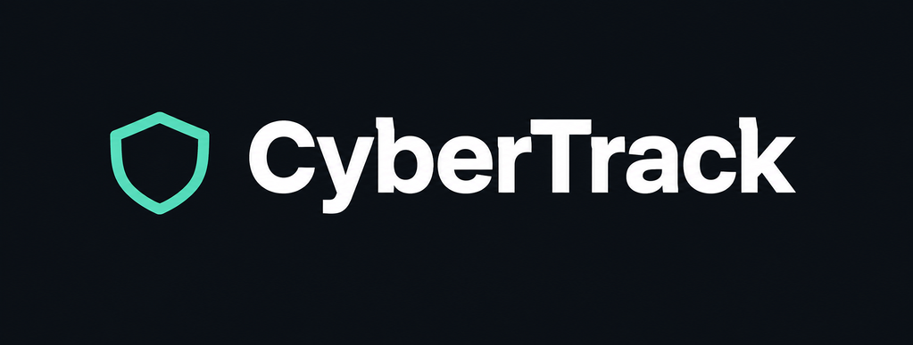

# Cyber-Tracking-Frontend
 
**Cyber Tracking** is a full-stack MERN application built for security teams to log, monitor, and manage cybersecurity incidents from detection through resolution. Analysts can report incidents, link related threat indicators (IPs, domains, malware, phishing artifacts) to each case, and open formal investigations assigned to specific team members — giving the whole workflow a clear paper trail from "something happened" to "here's what we found and fixed."
 
The app uses token-based authentication with role-based permissions (analyst vs. admin), so every team member can create and update records, while only admins can permanently delete them. A summary dashboard gives an at-a-glance view of open incidents, severity breakdowns, and active investigations across the team.
 
We built this project to practice designing a real-world, role-based application with meaningful relationships between resources — not just a single CRUD model, but three connected entities working together the way a real security tool would.
 
## Getting Started
 
- [Back-End Repository](https://github.com/IDAC1899/cyber-tracking-backend)
- [Front-End Repository](https://github.com/IDAC1899/cyber-tracking-frontend)
### Entity Relationship Diagram
 

 
[View/edit the full ERD in diagrams.net](https://viewer.diagrams.net/?tags=%7B%7D&lightbox=1&highlight=0000ff&edit=_blank&layers=1&nav=1&title=cyberTracking-erd.drawio&dark=0#R%3Cmxfile%3E%3Cdiagram%20name%3D%22ERD%22%20id%3D%22cyber-tracking-erd-native%22%3E7Z1Zc9s41oZ%2Fjau6L5LCvlwmjtOdbzrdU0m6vpmrKawyZ2TRLdFJPL9%2BQIqyJBOWFQmSKQquXiiIhLg8OHxxAJxzgS9vvv8yVbfXH0vrxhcI2O8X%2BN0FQohjHv5Xl9y3JQDiecloWth5GVgWfC7%2B6%2BaFELald4V1s7ZsXlSV5bgqbtcLTTmZOFOtlanptPy2vpsvx3at4FaNXKfgs1HjRelrsSz%2F%2F8JW1%2FNyQcGy%2FFdXjK4Xvw1B%2B82NWuzcFsyulS2%2FrRThqwt8OS3Lar518%2F3Sjev7t35n3j%2Fx7cMJT92k2uaAqqjCZXUOauuZVfeLi67c9%2FDd2%2BvqZhwKYNj05aRqHw6Ui8%2FtAfX3alyMJmF77Hx95Fc3rYpwE9%2B0xTeFtfW%2BzXGX5bicNj%2BE2RVCGLfl79VNMa45uSxvChPO6LOazML%2FPn4OO8yqafkftzh0Uk7q2uYn%2FlWN79oTv0Bs3Jx5uCY2qppd5iX1D6xdJPvrrr7vb828yjfhy%2BlI%2FxTu4GXYpHDx%2F5%2BbSkB9%2FKtZcwfqXTm4%2FT6vva1m8XuX%2F3x79Sns8OXTm8u%2Fffj9l7B5cYUuBLiQJGxffXq3OKPwnOYntX6ioXj17JsLDHfTfV95WO3j%2FcWVN66a3oddrlcIxC1u35a00gWTbS2cv6bzgrZdStk2mba5jB6qXvIUNlqk4ngZ7hyE1DuLHNkGs9AebuvNSukGjlmlpgvKwkXUz2ZSqWLipi1l4VmN1e2saHZ%2F1%2BxxXYztb%2Bq%2BvKsWFS0%2BvfXFd2d%2Fdco%2BHP8sZauYs%2FC5bgifF622%2Fr2x0m78Vpn%2FjKbl3cQ%2B4vER3e%2Bbvwd4F9aj4b0Yj1f2BICFv3rPb8XNWE3c%2B5XvrfPqrmFjvRE0x2HctJ%2FmbJxtr%2FPB0MBYI%2FlzFm7ITmDxLlmEr5MFyTpYnIAEZCnow6Vy57mMGLAIeE9R9qm%2BLW%2Bvy2nx35qtcftYV8kDK4%2BhpudR0duyeZeBjY%2BjKm8XwDQGsdnUZVWVN%2B2HaXtbQRRrOy1vv6jpyC12ecTLe35Frkgovy2LSdXcWfo2%2FFNbLxCaNn1Xmy%2F6Fi4%2Fh3%2Fq3acB0Ek48dCs6rqdmlXf3CxRc%2BlyHrHQO4CHxNPc3a8bvb0wc9p4ozEznOkIZl0KI5iFI6pCjT8FMaImo8aurbxHv10Xlft8q0y967egmeZWrpYuavn4nwarDHfOj5u2fR3eqW4SsyUy%2FP0whA1Jbnr11c2B2gmAx7Jge4PYAeV94YJUS0QLpBvwaGtbPrEfr06Nw62bqCpYh2CHZx3oHs50Sw4dgcpDgTzGmcOX5fDL%2Fa1LhuEjGZYaS3BYLKkS0DgjhPcZyxfG8o%2Fbqigns1RkPvRRFz33tGQ%2BVH8gMj3HCmpNrbD07PVh2xk5E2nIn5WGVCSQhgwpIbn1moOYNOwC2Dvb12LxQmZv5YzRFYJwSzP3r2JHDdjFYq%2BX7RbVJTZpWGHrdDBYArAM3NGA%2B0P%2FO1z%2Fh3TUpZR8G6o%2FFIVchH8lAobGHC%2BZwsNQ%2BPe%2FpeIvqbDbUP2B%2BEMMOCwo9NrGrGAWdsMVds%2F7%2FARNIOwIRJg5hZHnMQvXBTBbuBQW7m5Wm4mbdK6V0%2FLwISuJ5NoCh2Id1kzdYaj7XE2LySgZc6ftziNCEAix8obwzODRGPzk%2Frorps7OJxj8OSn%2BCt8021%2BmxU0qNk%2FcoccR0EBiDrGOuVuy7hus7iPoWd0HF3PI9hJ%2BRiAbzBvSSsgYYh0Cs%2FlL0rVVs9m3crqbgyUCxz4v3W2qS2zYpPMGWyeIRiJTdwrCLwZJQuG3qfoDMWgABIpRiJGIzNPLDB5F%2BP06vy4E%2FDScLQL%2F9%2FmP31PxmVL8bar%2BUPMMjILQaM4cjb6Zs%2FgbqvjbYjQX0hReP2Wp5dRzaoGJINYlMJvAFCZwd4%2FfyY%2FnEqOR9NRhImMv3Uxc74Tf8EZzqULWO8EChD4z%2BELCD72qoQHmWk13nL43uFFeSQhEAjkESF7ecVaCbxtvn0AJBJ%2BWxDgmsCUysm4yQmA2fSlMn7tRxTgVGSfm6kOeAAkFcEbGXH0Zud4pvuG5%2BiREijpvJSWxeQaZwWOP8f5WfnNTo2a7dYOH5%2BtjnHrvMLSUZV%2FfeUk%2F%2FKz0CyUJpJ%2BVygmAvPPhkXcR6xKYbWAKGzgtxzsauS4Ye711t6gusVHTiBLABfZ80XfJxPVc%2BUUgSan8NlR%2FKOUnlEXESkhNtnrHY%2FBqcnczDxGk7E0xmYs%2BNVHj%2B1kdf%2BiC158fIrq8Wf0yDbZJ9eCG6g8V%2BkBZiLVg0vDYGvOsBwerBxl7Xg8ynkAPOgK5EZZIRWMjcV0Cs2VMYRnN1AUrYd%2FsZukidOzzQt6mutTuQO6V9NpR4mODbxm7w2D3LjzAZMQllISbqj9UlAzAsQReKShUJvBoBL65q8pUBKZUd5uqP9RycoGEAgID52OjcFndDVbd4edn9uFFsLP9lnVYaQBjihgVm0vQJTAbuRRG7u7W7qHuInTs827dprrElk0BiaTVnjsYW0yZseuZuoshklDdbar%2BUEsmiZKAWcG9jTmdM4E9U3cRRFKqu03VH4hAQZkU2ApFYUTd5fjfPYn%2F%2FWFiCuuacPg%2FvVMT9fNO%2BBISVOnK3yb3XVurYIeIDS553XVVXCoYs3tdKIfcp8ixwWMdixSYEQYgY8QS52MRCboU9u71Opzgt%2BccGxxDqgElXlOZOXxhDnNs8OU8PomxVEgQrGODahnLHBv8ueoPNe4GtQqVY4VwjMzz0odn5XPeYnFRktjg2HClIESURLMTdQHsne07Sc%2FLrrHBT39lkXbOYKs1syI2lSAD18PY4MNbW%2BQCf4YYzB3KFPY%2BNvjwlg556qAzFljGsrA7K2G3hc%2BvY%2Fx2UnbCGIupdVxLEEGsS2A2cSlM3Eqi4rPz7xEIqAq8ORyNypyR693aoeE584hzHFkWKIzmRMgMHmPVOH3VPOZ9AgUNz5dnBMdCCExdrMuRJd9gJd82gYJQCmceYRQqLsK%2FKib5ugRm25fC9lk3M9OiGbhIxceJOfWwo9gzgJ7IYZrB653wG55LD0jEoVecm2hY3MzgMYQfBLXy20%2F6Dc%2FbxxUBigGNkYotXsvSb7DSjz6%2FMBzyFN4%2BQognUofXMI%2F1LroEZuuXwvrNXLiqorpPBcc%2B79xtqktt2EAw%2BZQiKaMh%2BjJ1vdN9MUgS6r5N1R8sYJUxEilrOIpGXckMHjhY0G%2Fhyhrx99HZIhS2KWJG1%2FOty2AfC6PqZzaPILRUjGn4TSkON1V%2FqL5zAMUR5xQnWRyelThk20SRZAnEIbbGYQap8QZFEOsSmE1kEnFYqeputz5wBI29ArYcP46kIcZrLaHDJuaOycz1ThrGIEkZNOj4cSSNpYB4I4iKLyvPDB5YGv5x69owkh8mX8P7uBipqsFzrgNn5fjrwnN4OS5n9XYszOS8mjRIJ41CdPwYk9ZIKbzwmotYFKKsFgerFrcYRUaLbNB7qUWAZKDLKy5xbAZNl8BsNVNYTRNsxKic7uZKPP0hZOos9p4JZ13MlZip651eHN4QspQMK2YZVNFVIZnBQ%2BtFvvhilsZbOLyhZKEYwxoRDHT2Fp6X%2FnveW4gxTKD%2FhNHSSKMForEBlS6B2QqmsIJqNitGE2e%2F7BaS7fQzzwBpqOBQ1FYsc3ciK4OHl3sGGggcC2ovOo0wU3iMaYTTeo4meHWBmLqpb8%2Boao4Bf87CexmBn97%2FbcfAf4PLOeOJdBwrj4GJJWrNenCwenCb4IE8RQ5CBIK9Q0BgiWwEsS6B2SIm8QfulXPm9BcTM06Eo1RRE01EmLHrWVTy4S0lxgYIZaE1Mjp8nAnsWVTy4a0Z1lIjqzgSdhGiOqu781B3WD6r7ghACdQd84pDIoWhIDbm0SUwG7kURm7PnDNdOvbK%2BLFFdalXjnCGEAs9FAhiAbAydj1TdzFEUuac2VD9oUIAEuGtwYzYWMaPTGDf1F0EkaQ5ZzZUf6gBDwgoAxQw5SI2MOec6UnOmS%2FXtSemdjt%2FmO2acGYRgm9Thhm%2BnmEGyg0wbz%2BYKwlD1BHLo1EAuwgOuQeRM8xEuhFJMsxg7RTBRnnOo9OSOxT27mU6nBQK55xhxlDPGZTU%2Bfj0qMzh8TjMGWZWhtCEpUowxWDG8oWxzBlmVsmk9YQXqQyNp2M4L314Vh7mLaRhkgwzTmuFpPWQ4dgoWhfA3tm%2Bk%2FSz7Jph5vQ1IPeOQY8cBtGkWRm4Hs4jHZ7ko4hpACGzUMdyXWYKe5VhZnjCzkEGuNXQAhHrcmRhd87CTqSIKqTDS5YCa4yMRhXqApgtXAoLN1E355pfRlKlHXEWgmh8%2B0xc79aID0%2FXAWPrmSvUExxbcJEZPMb6IJTzy3Rfx9wpJzhUHmZP3lkJPkKeFXwQplgJ5BRD0nmmrI1O2usQmG1fCttX7TqQFgFjr9W4W1SX2qhBKIX3UBMUi0WVieud4otBknJF%2BIbqD9Xr8AQS5gmHPpbVMjN46KhAbPFFqqhAXYaSrgLfUP2hOiWKUIA95QjGghZk7Tdc7fd8VCCYZBgXAiSooFYCE51I2iEwW8EUVnC%2BmYiMEwsIhD2h1GhiSHQILSPXP%2FE3uHBA0BEIBaFQu1gwtMzgMdx9N%2Bp7%2BC%2FdN6%2Fg4IL%2FEIkdB1R4zKMGMsu%2Bocq%2BLfIKIpAiGCTCSlHKPEfRYOBdArP9S2H%2FzjyvoFdCGKyhVTI2tSBT1zvlN7y8goIgaIU3wpNs%2BXJewZPLKyi49t4C4LSJ8ZvF4WDF4RY%2BQUR5AnFIlSQSAK6Ejq767RCYTWQScbh7XsEBOAU1QJAQIgiNjcZl5nonDYfnFJTKUYqpDC%2FPaKT6zOCBpSG96IwIryUMfGOq4muyYZNT9xJq7ZmUAVeTV4KclxB8fmIgfmwqd4sypBnESGKPiYwg1iUwG8QkQrC8m5qznRoICKcUaOhcrPORmeufEBzc1EBKDMZOOoujo8OZwQMtNW9CuNSuv%2BXo8L4LQoY3KRAzyZFXiCCSQ%2F%2Bdl%2B7bIlUgSbEghGsqEDam5iiCWJfAbP9S2L9iYgpb3%2BbzdAEyCQ1HllJHYi7ATF0PA7wMzwlooTKEYk4Ji%2FU%2FMoUvmSjww4OFzMkCV5aJCMQkQUpoH3PTZEU4WEW4iC2%2BSRGKFEPCmFsoBTSU6eisgw6B2SqmsIr7JQuM0LHPy3ib6lKPyAErEbPhpcyiYxwZu36lk4khklAObqr%2BUO5oAiHRAhMFot6WTGC%2F0slEEEmp7jZVf6gOCSf12xdCLfOEv7NSd1tE%2FCMMJVB3QDoOlPDURVeDdAnMRi6FkdsvWeDpx%2F2zyAnjPGM6OucvY9czdTe8qH8ScCAcs4hgmwnsv7obXng%2FEwgDGmiJVU4W2N9kgR8mX4NcLEaqnqFQe58%2F3k2cm%2B7ogRbgaWG3SBvIHqUNfBhv2M%2BPZ5AM0EEMfWx0o0vjkDsTOW9gpEeRJG8gcBx5pDljPDaBqkth796rw0mMdc55AylhTHlCDYGxSBqZwyNymPMGLs2jBhxKQqlWsWGNjOURscx5A9f0IZKacU%2BM1ejs9WF2Nh8gbyCwwbAJQeq4kzHb1wGwd7bvJF0u55s3kBIJwtO1yDCWgTuNaaXDk3zSQao45RLKaI84U5jzBh6SP%2BQRhQoyrkysJ5yF3TkLuyR5A7GEniIoJaaxDFpdALOFS2HhqqIan2viQA2tBpAjZH2st5qR691a8eEJO6SdIgISL6IjapnBY6wXojlxYHc5JXIOSce9Q1nxnZXiO1riQAhU6LhKYT2I%2BfK6BGbbl8L27bdO%2FOQjBGGJuYLeQBQN05ep66FDb3gxgpyWpg6OJhSJjeFmCk9%2BnfjwIgdxKLAhhHkdGwnJinC4ivBY6QSFstBioinl0RguHQKzVUxhFdVsVowmzn7ZbVr96ccOgnXCtoCdkCg6qyBz10NNOLjYQc4jS%2BqVuNrH1lFmCl9SE%2F45C%2B%2FlHDdoNR0Xh0EGYMEx9VkPZj24pgfT5BmESglOIcPCxhDrEpgtYgqL6IuJLSajc00mA603XDkliI%2F5ZjJ1vRsXHp4WxA4bwZCXWsYCB2UGjxdDHIGcYvoRnQoCYqggBLMYnVn6nbX0SxJEnBFhJfDWOxabf9AlMBvAFAbwvLMIKiYVV5o5GhN%2Bmbks%2FA4u%2FJSTWgkLMNcmM%2FgCWQTJ4osnsgj%2BXtbjwp9rhbJjVunh6UHsQoeE1mvOXWz8JOvBwerBSArzjh5MEkKcOSiAwkEW6ugQXYfAbBdT2MXbaREaY3WfCo593sbbVJfYsPHwmpWcAk5i8dUydf1ThDFIEirCTdUfau2vtxQQoYCNThXMDB5aEf4WrqzxB350tgiFzfav4VTnW5fBPham9hm2cnE5oJyG35TicFP1h4rTKwnSwjoHZA4aeFbicKuMgziBOASaWM0BAsjExom7BGYTmcJETsrKnauvEBGqKLdCax7LmpWR650yHJ6vEFhvgYCAAGMzg3mQuF9OQcqMtBp6%2BbBaNOu%2B89B97HmnIE4SNAYK5IOVlUSqWNeiS2A2gCkM4Gw%2B%2BLFj5pkIHfu8d7epLvk4sWbCc4ytii1Tytj1LPNMDJGEym9T9QfzSzstASNaqtgocSawZ5lnIoikVHebqj%2FUPIXQ%2F7WMCu%2BjLpes7gar7rbJK0hRAnVHlXLcEE6IjU6F6RCYjVwKI2fKm9uxO%2BfMgkhSJ1zoVTAQs20ZvJ7pu%2BGFBQzCzljPNbTZ9L2IZy8NhacdA3D67lv5Tk3Nq8%2F%2Fuvs3%2BePyL630K9hOMnB25FZuTTzxYHk3NYu3SugvK6g1tcJ25ynUtS0ysgRVdF2O6sdwtSxde8poHWU3sW%2Bm0wbFq08Buy%2FlRzW5v1hN0Qea3cKV%2F2P1wz%2FrD0GQtR%2FffV%2F98t1CU7rvRfWPxU%2BF7ZWjwqflQfWHxTHjQquvZWE%2FlXdVPV4xP%2FopAquFrrxoYqAwhjUiGGgVFWybKXywTFM3VlXxdf0hbTJhHRbDTVX3Kzu08nZ5Cn%2BvC5Z0c7KuAgVEqwQ%2Buz8EbXD7JbLzU4gfzuB6jkPxuDXM8WuP2nQejyrijyuaP59ORcmaFPuBJjXcNrNlf6W%2F%2BKM4j09i92h%2FSFoTvy3%2B5LVc%2BROPf%2Fw1eLQOa9v20EkeGk7sNcDLn6JHbR6L1njQ5sH2ax4wN4%2FnmgfE%2BFH7wAFRsZFEiMX%2Bx4QC9uigZ5pW91R3fbXUNb0GK3%2Boc2rHbUtom6aznto41lNYaSpPdxHWiSXxDkIEYtZkXr6ut9roO%2FOSur2Gfb1qNSX7666sy7udgoev1q5rUVjX82rWNPx6eicGt9%2Fnv%2FJw0Px3PzVtpJzMrovb2eIkwm2fn8f6uYXi7gnfjaO%2FX6e4fqXGxWgyP4F5zyhyAot6xsWRbgWkT9yKxe%2FObtUkWpF%2BSND9yswfcF3fdKR%2FAvNpEs3Cqnbj582%2FEbCpp%2FjMS9u4SxdX6CK0FVnDsgzP%2BXDv148J%2B%2FwU0Hzz%2B8%2F1kSt7NWff7lNXCC4kWdnFlNat%2Fu7rJu3Zw%2BGrXzcm1LvQikw90Rfo%2ByfqWZzs69Uge%2FEqm1rrVoHA3fyqTXO3tWsMxPzwursQagA39fsotPa2%2Btn86NgZPP%2FDoZpZc0GLecvPod4fIPU0cnqxs%2B7PKR%2B%2FDa3Es11tR1%2Bup04dthU90J%2BgJc1P93XRbf1PtaLlrm1LulZf3bLtVE2FG1rOcz%2BV281ZtpsPk69uVhWjRhxs1Xzibaet9UjNZ%2B2sE7aiYrXe3JhyY%2FoRIfejDenl1dxqIzqUpNuuQR1F14XCuhezKNxhWISg7uQUits1E4tqyGOPE0kQPjLeAyb9d7b%2BoDdpj8EGzCRHXoWHtPDFn447icF1Hw3kz7hiHh1A27WQu%2FqE4KOwBlv7hMijmvjjmnZ2AoWP07K2xcvdp%2Br2%2BmMwCvUe%2FwM%3D%3C%2Fdiagram%3E%3C%2Fmxfile%3E)
 
### Component Hierarchy
 

 
[View/edit the full Component Hierarchy in diagrams.net](https://viewer.diagrams.net/?tags=%7B%7D&lightbox=1&highlight=0000ff&edit=_blank&layers=1&nav=1&title=cyberTracking-component-hierarchy.drawio&dark=0#R%3Cmxfile%3E%3Cdiagram%20name%3D%22Component%20Hierarchy%22%20id%3D%22cyber-tracking-component-hierarchy-teal%22%3E7Zxbc5s4FMc%2FjWd2H9rRBST0mDrpZXrZTtKZbvelI6GDzRajDCYX76dfYYMNVrJrEzC9kJegowug3xHnjyw0odPF%2FatMXs%2FfGw3JhCB9P6HnE0II8qn9V1hWGwv2MdpYZlmsS9vOcBX%2FA6WxKnYTa1g2CubGJHl83TSGJk0hzBs2mWXmrlksMknzrNdyBo7hKpRJZX1Od%2FbPsc7npZ0jtMt4DfFsXp0cVTkLWZUuDcu51OauZqIXEzrNjMk3R4v7KSRFB1Zds6n38pHc7RVnkOaHVMjj3N6XU6lsZ5mvqrvO4d7mvZjni8QasD2MTJqXdLCo0mWFIl8m8Sy1xwlERc1byPLY9uJZaV7EWhdl1%2FWmJjHZ%2BkQURQx8VtpfykWcFI4yNYs4tFd0JdOl%2Fff%2ByhbYXOOtTG7Ka5wQlqwv0l4%2Bm%2BXrIhtL0VZlm355cXFpK366PJu%2BffPhlT2cXJBJgCbCs8fTP95%2F%2FOPDxYdP9vj1m4vLs8vp6y9VO7Yj603VzPVzri%2FL3i7c13qz7P9XYBaQZytbZF5zEVr6w93On7hf2spWgjJZjhtRJmXpzrNtwzvc9qAk%2FjD9UKEIlGZIEBoc4gWZuUk1FLWRvdO7eZzD1bUMi9w7O9z3HCROkhrYl%2Bs%2Fa1%2FmmfkGDyHf5FRjih7iBDUvJMj1JhwRjxb27UBbu2YWVp7rPeRIZx8%2FtqLIXYoUNSn6oolx%2B1h7EkfEaBghHFIFB43m75rjmkknHD%2FIW1umK5Q4aKLEtImSsi5QEokUi2iEQsWOQ4mPRql5hED%2BECjfmVmc9kWS%2Bn2Q1CqQgUDCjks9ktySvIRZvMyht2Hp8z5gguaAGWLIk3x8wm5hfsxMbkU26Etzk0NXSInXRMpFH0h9bseNJhozRTbNgXakv8vY3GQhPKqfai5QtFYJYpPlczMzqUwudtYXzRFfcwhI9VnxqmKTKjHhtyN8gRziC3Af538WvvncL1NfqjPb4%2FP70m3XiVWVSG0H1yoVyS%2F1vF21daqqt%2BmXXGYzyB%2BVKw0V%2F5DHZJDIPL5t4nlaoLWAsECRF3p4xH9K%2FK7EGQC%2F1trjilKp8Ij%2FpPhdXTQAfuFRYB4Bojw14j8lfldJDYE%2FBCFQqImMjnxh%2Fqm1%2BblczpWRWTUun67k9qY%2FPNJUcj7pQsnhUGomaKQiIUeaW5pv0jDWthuWfdHcznh3SjPUSIPV%2FEFUvZaPNG3q0zwD2R9LjFgfMD2qg4AJFgb%2BOAlSH5q3sMzjmQ1rJu2OKdljynphKgjj9p4BhxXTo7WTKwJG7XSAdnJlywDaCQXEA%2BCUCxqO%2BE%2BJ39U5A%2BD3mBBEKkS14iP%2BU%2BJ3hdEQo59QT3mIhVL5I%2F5T4nel1AD4pY8kRFJjycMfX89V2Dt71XoXL%2FOu1Bzm%2B79S%2Bg0xxzr5FQRJpBUNAkSDEagL9KXJFn0B9ffUeTdA7eMVCQkEBfAfz%2BNfFug55DJOOnvl2mfK%2FT6YQugpwQjzddXc0UHX1Y5j0D0g6LrxbhDJzbUEKT0I5Ij%2FlPjd6DgEfgCr%2BBWNmCQj%2FlPid2PpAPgp59SjEfI8%2BAlWBHYW0Dfz4X0Kbry%2FwrObYC6Z5DRgGjHmjzz3ePapt4XXB07bw%2FbJjJB9vkYjzj2cPattTEkfSLVPitdtrrDULQOuO1c3BtwDAq4b6wYIuJFAfhBpgq0HjPhPid8NjYPIbeEV3LSnohH%2FKfG7oXQA%2FAEnQqiQY1J9qjrG88neioVeVbffS0xnQRQhrBkPfoYVf%2F1g7VN8Y94LVsGY1FxwxfCRX7D%2BOlj7FuEC9zJgoxCCwBdU07YL9N1fTMcwfEAYdiPgEGFYkYhLKiUKR%2Fwnxe9GygHwM6apEiQEBm1XGY34260xdCLqEB%2FnBV4YoEDLgB45qfY9fm7bWVifmjSKs8U5JFB8bYt%2B2wjx9Y4zxZlNmqx%2BbxXnAzfOO6uJMWouQAk62YOEcQFeJLVkuu2Pm%2B6PtONIP2Cku4NsgJHOwVOhJ8JAkrb43UnDEf8Pg18xGWCkGONtl5O6cnXE%2F6Pgx5hxGWqFtrMD%2Fb2%2Bt4rzj4Tn4KHo3CrwbqNsLfJ6buRtBF7RSeCNCMjAY4p5nj6k7x%2FZAq625Vtd8xQ9VG0BF9pWIXNF0BP2ensLq1bd%2FcBGa%2F%2FX27vt%2B562LjNSgDQHzccdZBqSdnFt0qIf2uBkB8hWto%2FT72Ti0Y4fbCWnjuBInN%2FjxGN3uzu13geoDcrtAp2noMTJV%2FIXuV4tpPjkP4P4%2FJ%2BvL57RdmKktp9mSxFS9PiuzDtjrsue%2FxvyfFX2vbzJTdNj4jSFrCj9Wa6uTVx89L3TEseqDFctbO%2Bre1Fgk7v9Ttd5tZ1j6cW%2F%3C%2Fdiagram%3E%3C%2Fmxfile%3E)
 
### Wireframes
- Sign In / Sign Up wireframe

- Incidents / Threats / Investigations wireframe

 
[View/edit the full wireframes in Excalidraw](https://excalidraw.com/#json=rjRiymKEOu-zMSIZnXn6w,g0Is113A9Oo_Ugg2iJhtKQ)
 
### User Stories
 
**Authentication**
- As a guest, I can create an account.
- As an analyst or admin, I can log in with my username and password.
- As an analyst or admin, I can log out.

**Incidents — Dana**
- As an analyst or admin, I can create, view, and update an incident.
- As an admin, I can delete an incident — analysts cannot, so records stay a reliable audit trail.

**Threats — Isa**
- As an analyst or admin, I can create, view, and update a threat linked to an incident.
- As an admin, I can delete a threat — analysts cannot, so records stay a reliable audit trail.

**Investigations — Muneer**
- As an analyst or admin, I can create, view, and update an investigation linked to an incident and assigned to a user.
- As an admin, I can delete an investigation — analysts cannot, so records stay a reliable audit trail.

**Dashboard**
- As an analyst or admin, I can view a dashboard summarizing counts across incidents, threats, and investigations.
## Technologies Used
 
- React
- React Router
- Node.js
- Express
- MongoDB / Mongoose
- JWT (jsonwebtoken)
- bcrypt
- Vite
- CSS (Flexbox / Grid)
## Data Models
 
- **User** — shared auth model (username, hashedPassword, name, email, role)
- **Incident** (Dana) — title, description, severity, status, category, assignedTo
- **Threat** (Isa) — name, type, value, severity, status, source, incident
- **Investigation** (Muneer) — title, incident, assignedTo, findings, status, priority, 

notes
See the [ERD](#entity-relationship-diagram) above for full field types and relationships.
 
## Attributions
 
- No external libraries or assets requiring attribution were used beyond standard npm packages (React, React Router, Express, Mongoose, etc.)

## API Routes
 
### Auth — Shared
 
| Method | Route | Success | Failure |
|---|---|---|---|
| POST | /auth/sign-up | 201 `{ user, token }` | 409 `{ err: "Invalid input" }` |
| POST | /auth/sign-in | 200 `{ token }` | 401 `{ err: "Invalid credentials." }` |
| GET | /auth/sign-out | 200 `{ message: "Signed out successfully" }` | 401 `{ err: "Login Required" }` |
| GET | /auth/me | 200 `{ user }` | 401 `{ err: "Login Required" }` |
 
### Incidents — Dana
 
| Method | Route | Success | Failure |
|---|---|---|---|
| POST | /incidents | 201 `{ incident }` | 400 `{ err: "Invalid value..." }` |
| GET | /incidents | 200 `{ incidents: [...] }` | 401 `{ err: "Unauthorized" }` |
| GET | /incidents/:id | 200 `{ incident }` | 404 `{ err: "Incident not found" }` |
| PUT | /incidents/:id | 200 `{ incident }` | 404 `{ err: "Incident not found" }` |
| DELETE | /incidents/:id *(admin only)* | 200 `{ message: "Incident deleted" }` | 403 `{ err: "Forbidden..." }` |
 
### Threats — Isa
 
| Method | Route | Success | Failure |
|---|---|---|---|
| POST | /threats | 201 `{ threat }` | 400 `{ err: "Invalid value..." }` |
| GET | /threats | 200 `{ threats: [...] }` | 401 `{ err: "Unauthorized" }` |
| GET | /threats/:id | 200 `{ threat }` | 404 `{ err: "Threat not found" }` |
| PUT | /threats/:id | 200 `{ threat }` | 404 `{ err: "Threat not found" }` |
| DELETE | /threats/:id *(admin only)* | 200 `{ message: "Threat deleted" }` | 403 `{ err: "Forbidden..." }` |
 
### Investigations — Muneer
 
| Method | Route | Success | Failure |
|---|---|---|---|
| POST | /investigations | 201 `{ investigation }` | 400 `{ err: "Invalid value..." }` |
| GET | /investigations | 200 `{ investigations: [...] }` | 401 `{ err: "Unauthorized" }` |
| GET | /investigations/:id | 200 `{ investigation }` | 404 `{ err: "Investigation not found" }` |
| PUT | /investigations/:id | 200 `{ investigation }` | 404 `{ err: "Investigation not found" }` |
| DELETE | /investigations/:id *(admin only)* | 200 `{ message: "Investigation deleted" }` | 403 `{ err: "Forbidden..." }` |
 
## Next Steps
 
- Add a comments/notes thread on individual incidents
- Add email notifications when a new investigation is assigned
- Add ownership-based edit/delete restrictions on top of role-based permissions
- Add filtering and search across incidents, threats, and investigations
- Add a full audit log of status changes
 
